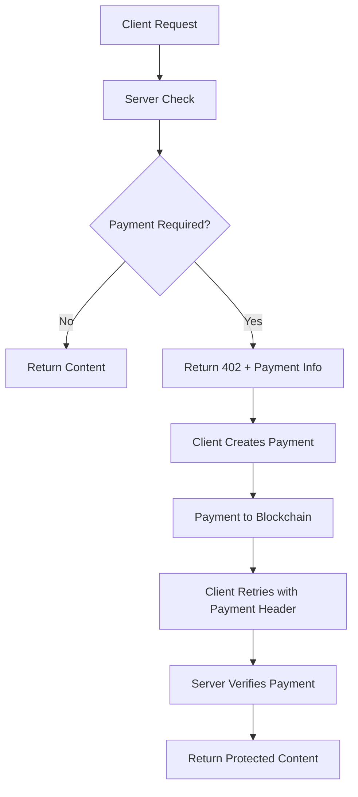

## Build Paid APIs on Sei

x402 Protocol brings HTTP micropayments to the Sei Network, enabling you to monetize APIs, premium content, and digital
services with instant, low-cost payments. Whether you're building AI APIs, data feeds, or premium content platform,
x402 makes it simple to add payment gates to any HTTP endpoint.

**Works with Sei's advantages:** Sei's fast finality, low gas fees, and EVM compatibility make it perfect for micropayments. X402 leverages these features to enable seamless payment flows that complete in milliseconds.

<CardGroup cols={2}>
    <Card title="Quick Start" href="/quickstart" icon="play">
        Build your first paid API on Sei in under 10 minutes
    </Card>
    <Card title="Sei Integration" href="/sei/introduction" icon="coins">
        Learn how x402 leverages Sei's unique features
    </Card>
</CardGroup>

## Why X402 on Sei?

<AccordionGroup>
    <Accordion title="Fast & Cheap Payments" icon="bolt">
        Sei's 400ms finality and low gas fees make micropayments practical. Perfect
        for pay-per-request APIs and streaming content.
    </Accordion>
    <Accordion title="EVM Compatible" icon="code">
        Use familiar tools like Viem, Ethers.js, and Hardhat. All existing Ethereum
        tooling works seamlessly on Sei.
    </Accordion>
    <Accordion title="Built-in Wallet Support" icon="wallet">
        Integrates with Sei wallets, MetaMask, and any EIP-6963 compatible wallet
        for smooth user experiences.
    </Accordion>
</AccordionGroup>

## How x402 Works

x402 adds payment headers to HTTP requests, enabling servers to require payment before processing requests:

## Use Cases on Sei

<CardGroup cols={2}>
    <Card title="AI API Monetization" icon="robot">
        **Charge per AI inference** Monetize LLM APIs, image generation, or data
        processing with per-request payments.
    </Card>

    {" "}

    <Card
        title="Premium Content Gates"
        icon="lock"
    >
        **Subscription & pay-per-view** Create premium content with flexible payment
        models - subscriptions, one-time payments, or time-based access.
    </Card>

    {" "}

    <Card
        title="Data Feed Monetization"
        icon="chart-line"
    >
        **Real-time data access** Monetize market data, weather APIs, or any real-time
        information feed with instant payments.
    </Card>

    <Card title="Decentralized CDN" icon="globe">
        **Content delivery payments** Pay for bandwidth, storage, or compute
        resources on a per-use basis with streaming payments.
    </Card>
</CardGroup>

## Package Ecosystem

<CardGroup cols={2}>
    <Card
        title="@sei-js/x402-client"
        icon="download"
    >
        **Client-side payments** Add X402 payment capabilities to any
        TypeScript/JavaScript application.
    </Card>

    {" "}

    {" "}

    <Card
        title="@sei-js/x402-facilitator"
        icon="server"
    >
        **Server-side payment processing** Accept and verify X402 payments in your
        Node.js applications.
    </Card>

    {" "}

    {" "}

    <Card title="@sei-js/x402-express" icon="route">
        **Express.js middleware** Add payment gates to Express routes with simple
        middleware.
    </Card>

    {" "}

    {" "}

    <Card title="@sei-js/x402-next" icon="next-dot-js">
        **Next.js integration** Full-stack Next.js applications with built-in payment
        support.
    </Card>

    {" "}

    {" "}

    <Card title="@sei-js/x402-hono" icon="flame">
        **Hono framework support** Lightweight payments for edge computing and
        serverless functions.
    </Card>

    <Card title="@sei-js/x402-paywall" icon="paywall">
        **Drop-in paywall system** Complete paywall solution with customizable UI
        components.
    </Card>
</CardGroup>
