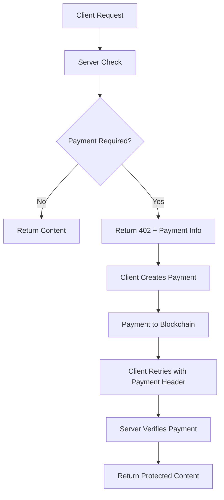

# x402 Protocol Overview

x402 transforms any HTTP endpoint into a paid service using blockchain micropayments. Originally designed as an extension to HTTP status codes, X402 enables seamless monetization of APIs, content, and digital services.

## How x402 Works

The protocol adds payment capabilities to standard HTTP by introducing payment headers and the `402 Payment Required` status code:

## Core Components

<CardGroup cols={2}>
  <Card title="402 Status Code" icon="warning">
    **HTTP Payment Required** Standard HTTP status indicating payment is needed
    to access the resource.
  </Card>
  <Card title="Payment Headers" icon="header">
    **X-402-Payment Headers** Cryptographic proof of payment embedded in HTTP
    requests.
  </Card>
</CardGroup>

<CardGroup cols={2}>
  <Card title="Facilitators" icon="server">
    **Payment Processors** Server-side components that handle payment
    verification and enforcement.
  </Card>
  <Card title="Clients" icon="computer">
    **Payment Makers** Client libraries that automatically handle payment
    creation and retry logic.
  </Card>
</CardGroup>
